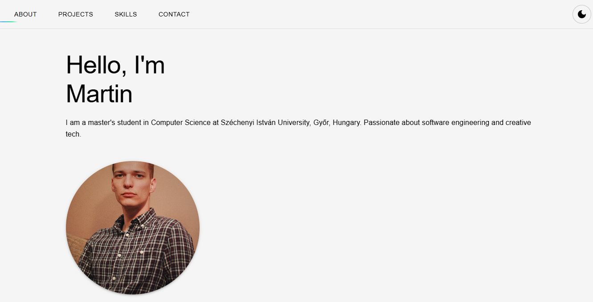

# portfol.io - Personal Developer Portfolio

## What It Does

This project is a modern, interactive personal portfolio website that showcases my skills, projects, and contact information. It presents my professional identity as a developer with a distinctive tech-inspired aesthetic featuring subtle glitch effects and smooth animations.

Here's what it looks like in action:



As you can see, users can:
- Learn about me and my background
- Browse through my featured projects
- Explore my technical skills with interactive chip elements
- Contact me through provided information
- Switch between light and dark modes for comfortable viewing

## Key Features

### Tech-Inspired Design Language

The portfolio employs a minimalist yet tech-forward design that:
- Uses a clean, cream background in light mode and dark contrast in dark mode
- Features subtle "digital glitch" effects that activate on interaction
- Includes smooth transitions between sections and themes
- Maintains perfect readability while adding visual interest

### Interactive Profile Picture

The avatar features an elaborate glitch effect system:
- Transforms shape and color on hover
- Simulates digital distortion with RGB splitting
- Creates a "broken screen" appearance with animated layers
- All achieved through pure CSS animations - no JavaScript required

### Responsive Across All Devices

The site automatically adapts to any screen size:
- Reconfigures layouts for mobile, tablet, and desktop
- Adjusts spacing and font sizes for optimal readability
- Prevents overflow issues even on very small screens like iPhone SE
- Maintains visual effects across all form factors

## How It Works

### Themed UI with Material-UI

The clean interface is built using Material-UI (MUI) with a custom theme:

```jsx
const lightTheme = createTheme({
  palette: {
    mode: 'light',
    background: { default: '#f8f7f3' }, // Cream color for light mode
    primary: {
      main: '#000000', 
    },
    text: {
      primary: '#000000',
      secondary: '#333333',
    }
  },
  // Typography and component styling
});
```

This approach makes it easy to maintain consistent styling across the entire application.

### CSS Animation Magic
The glitch effects are created using complex CSS animations and keyframes:
```jsx
const glitchyBorder = keyframes`
  0% { 
    clip-path: circle(50% at 50% 50%); 
    border-color: rgba(0, 255, 255, 0.7);
    opacity: 0.3;
    transform: scale(1);
  }
  20% { 
    clip-path: polygon(50% 0%, 100% 38%, 82% 100%, 18% 100%, 0% 38%);
    border-color: rgba(0, 255, 0, 0.7); 
    opacity: 0.5;
    transform: scale(0.98) rotate(-1deg);
  }
  // More keyframes for the animation
`;
```

### Persistent Theme Preference
The site remembers user theme preference using localStorage:
```jsx
// Check localStorage for saved theme preference
const [mode, setMode] = useState(() => {
  const savedTheme = localStorage.getItem('theme-mode');
  return savedTheme || 'light';
});

// Save preference when changed
useEffect(() => {
  localStorage.setItem('theme-mode', mode);
}, [mode]);
```

## Design Approach

### Minimalist Base with Interactiveness
The design philosophy balances:
- Clean, minimal base design that keeps content readable
- Interactive elements that respond to user actions
- Tech-inspired animations that create visual interest
- Consistent spacing and typography for professional appearance

### Performance Optimization
- Despite the elaborate visual effects, the site maintains excellent performance:
- CSS animations rather than JavaScript for better performance
- Conditional rendering to minimize unnecessary DOM elements
- Responsive images and optimized assets
- Smooth transitions with hardware acceleration


## Technical Details
### Technology Stack
This project uses:
- React for component-based UI
- Material-UI for design system implementation
- Styled-components for advanced CSS-in-JS styling
- CSS animations for interactive elements
- LocalStorage for user preference persistence

### Project Structure
The application follows a logical organization:
- /components: Reusable UI components
- /data: Static content like project and skill information
- /context: Theme management and global state
- public: Static assets and images

### Responsive Strategy
The responsive approach uses:
- CSS Grid and Flexbox for layouts
- MUI's responsive breakpoints system
- Custom media queries for specialized cases
- Container constraints to prevent overflow

---
*This document provides an overview of the portfol.io project. For more detailed code documentation, please refer to inline comments.*